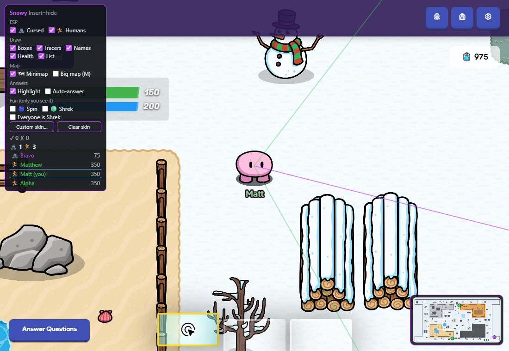
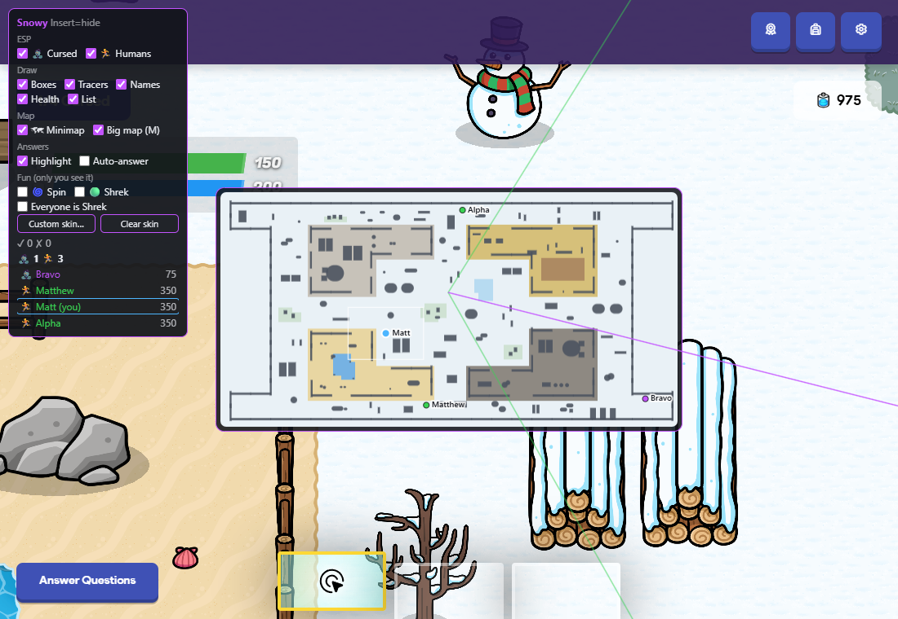
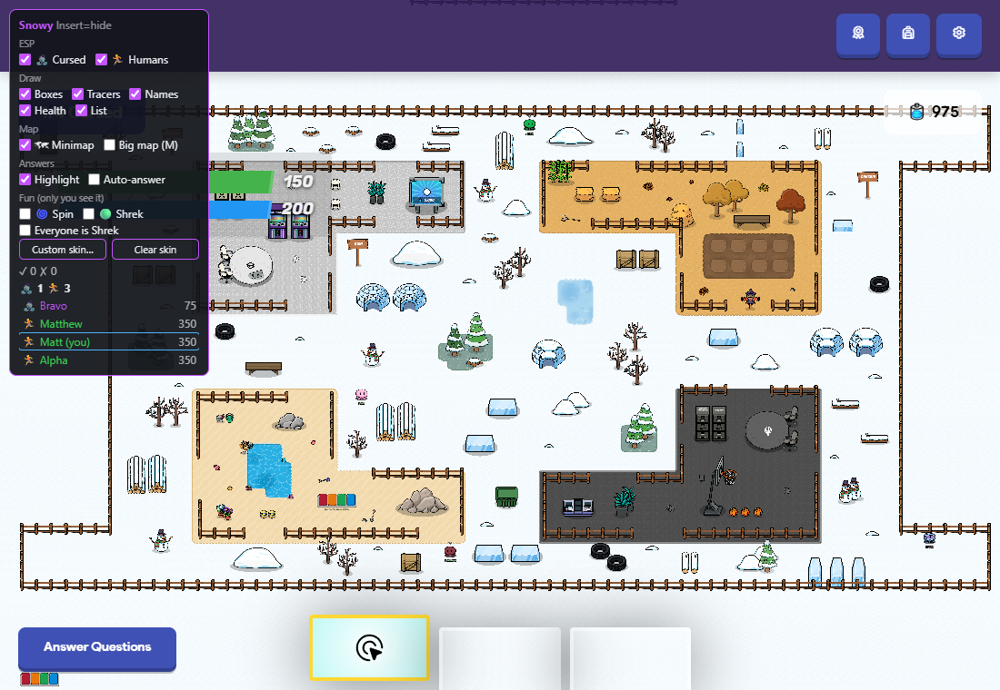

# Snowy Survival minimap: design brief

> **For Claude Design: you design, Claude Code builds.** The minimap is already written and
> live-tested in [`snowy.js`](snowy.js) (section `// ---- minimap ----`). Your job is the **look**:
> the frame, colours, dot styles, the big-map view, and every state below. Deliver static
> **HTML + CSS** mock-ups (one file is fine). No JavaScript or wiring needed. Claude Code maps your
> design onto the renderer afterwards.
>
> Checked in a real, muted 4-player Snowy Survival game on 2026-10-01.

**Contents:** 1 · The product · 2 · What exists now · 3 · States to design · 4 · Data you can show ·
5 · Style knobs that already exist · 6 · Constraints · 7 · Reference

---

## 1. The product

**Snowy Survival** is a Gimkit 2D mode: a few players start **cursed** (zombie-like, purple). They
chase the **humans/survivors**, and anyone knocked out becomes cursed too. The mod runs on top of the
game from a bookmarklet and already has an ESP, answer help and a roster panel (top-left).

The **minimap** shows the whole arena in a corner, with every player as a dot:
- **you**: a distinct colour, slightly bigger, with a ring
- **cursed**: purple
- **humans**: green
- also: your current camera view as a thin rectangle, and walls/fences/terrain so you can plan an escape route

Pressing **M** (or the "Big map" checkbox) opens a **big map** in the centre of the screen with names
next to the dots. Press M again to go back to the corner.

Users are students, often on **school Chromebooks**: small screens, slow hardware, **no F-keys**.

---

## 2. What exists now (functional default)

| Small (corner) | Big (M) | The real map, zoomed out (ground truth) |
|---|---|---|
|  |  |  |

The current styling is a placeholder: a dark rounded frame with a purple border, flat terrain colours,
dark-grey walls, and plain dots. Layout and scale are accurate (compare with the ground truth).

**The arena is wide:** about **7000 × 3600** world px, so roughly **1.94 : 1**. At the current 190 px
width the map is only ~98 px tall. Pick a size that stays readable without covering the game.

**Screen real estate in a live game** (1100 × 760 viewport, see the screenshots):
- top-left: the mod's own panel (220 px wide)
- top-right: **Gimkit's three round buttons + the energy counter**. **Don't put the map there.**
- bottom-left: Gimkit's "Answer Questions" button
- bottom-centre: Gimkit's item hotbar (3 slots)
- **bottom-right: free.** This is the current default corner.

---

## 3. States to design

1. **Small map, in game.** Mixed cursed and humans, you among them, camera rectangle visible.
2. **Big map (M).** Centred overlay with a name next to every dot. Should it dim the game behind? Your call.
   Needs to fit a 1100 × 760 window and a small Chromebook screen (1366 × 768 with browser chrome).
3. **You are cursed.** Your dot is still "you" coloured, so show your team somehow (ring colour, a small badge…).
4. **Lobby (before the host starts).** Teams don't exist yet, so everyone is **neutral** (currently gold).
   The lobby is a different, smaller area of the map, so the frame shows a different shape.
5. **Spawn-immune player** (a few seconds after respawning; they can't be hit). Currently a thin white ring.
6. **Knocked-out / inactive player** (rare in this mode because lives are infinite): currently grey.
7. **Crowded:** 20–60 players in a class. Dots overlap; cursed are drawn above humans and you're always on top.
   Make sure your dot is never lost.
8. **Dot near the edge** of the map (players hug the outer fence). Dots must not be clipped by the frame radius in a confusing way.
9. **Hidden.** Insert hides the whole mod (panel dims, map disappears); the "Minimap" checkbox turns just the map off.
   Nothing to draw, but the panel checkbox row ("🗺 Minimap · Big map (M)") is part of your design.

Optional, if you think it helps: a tiny legend or a counts line (🧟 3 · 🏃 12) on the map frame.
The counts already exist in the roster panel, so this is purely a design choice.

---

## 4. Data you can show

Everything comes from `__snowy.api.minimap()`, which is refreshed every frame. All positions are world px.

| Field | What it is |
|---|---|
| `phase` | `"preGame"` (lobby) or `"game"` |
| `snowy` | `true` when the mode really is Snowy Survival (otherwise everyone is neutral) |
| `extent` | `{x,y,w,h}`: the map frame (changes between lobby and game) |
| `background` | colour of the base snow |
| `terrain[]` | `{x,y,w,h, terrain, solid}`: 64 px tiles. Terrain names on this map: **Snowy Grass, Light Scraps, Dark Scraps, Sand, Dry Grass, Dirt, Water (solid), Frozen Lake (solid)** |
| `walls[]` | real collision shapes of fences, ice barriers, trees, igloos, rocks, snow piles: `rect` (4 points), `circle`, `capsule`. Each has `propId` (e.g. "Horizontal Wooden Fence", "igloo", "bare-tree-2") if you want e.g. fences vs. trees drawn differently |
| `players[]` | `{id, name, x, y, kind, team, hp, shield, immune, alive, self}`. `kind` is one of **`me`, `zombie` (cursed), `human`, `neutral`, `dead`** |
| `me` | your own entry (or null) |
| `view` | `{x,y,w,h}`: what your screen currently shows |
| `counts` | `{zombie, human, neutral, dead}` including you |

**Not available:** which way a player is facing, what they hold, chat. Health is available
(`hp` + `shield`, max 150 + 200) if you want e.g. a low-health tint, but don't rely on it for the core look.

---

## 5. Style knobs that already exist

The renderer is driven by one theme object (`__snowy.minimap.theme`). If your design fits these knobs,
you can simply hand back values. Anything beyond them (gradients, glows, legend, badges) is fine too;
just show it in the mock-up and Claude Code will build it.

```js
size: 190,               // longest side of the small map (CSS px)
bigSize: 560,            // longest side of the big map
corner: 'bottom-right',  // bottom-right | bottom-left | top-right | top-left
margin: 12, radius: 10,
frame: 'rgba(18,20,26,.88)', frameBorder: '#c353ff', framePad: 6, opacity: 1,
background: '#e9f1f6',
terrain: { 'Snowy Grass': '#c9dccb', 'Light Scraps': '#c4c6c9', 'Dark Scraps': '#55575b', 'Sand': '#efd39b',
           'Dry Grass': '#e6a65a', 'Dirt': '#a77b52', 'Water': '#5fb0ea', 'Frozen Lake': '#a9d8f3' },
terrainFallback: '#d4d8dc',
wall: '#4b5360', wallAlpha: 0.9,
view: 'rgba(255,255,255,.9)', viewWidth: 1, showView: true,
dot: { me: '#4db6ff', zombie: '#c353ff', human: '#39d353', neutral: '#f4c430', dead: '#777' },
dotRadius: 3.5, meRadius: 5, dotOutline: 'rgba(0,0,0,.75)', meRing: '#ffffff', immuneRing: '#ffffff',
labels: false,           // names on the small map (big map always shows them)
labelFont: '600 10px system-ui,sans-serif', labelColor: '#10131a', labelHalo: 'rgba(255,255,255,.85)',
```

**Colour meanings must match the rest of the mod** (ESP boxes, tracers and roster already use them):
cursed `#c353ff` purple, human `#39d353` green, neutral/lobby `#f4c430` gold, you `#4db6ff` blue
(the roster outlines "you" in the same blue). If you want to change any of these, say so and Claude
Code will change them everywhere.

---

## 6. Constraints

- It's drawn on a **canvas** over a WebGL game. Keep it cheap: no blur filters over the game, no
  per-frame DOM. Static parts (terrain/walls) are pre-rendered once; only dots move.
- **Must not catch clicks.** It's `pointer-events: none`, so the game underneath stays playable.
  So there's no clickable UI on the map itself; any controls live in the mod panel.
- No external fonts or images (the page's security policy blocks most loads). System fonts only.
- Small text on a busy map: use halos/outlines for any labels.
- Bright snowy background in game (white/pale blue) **and** dark areas (the Dark Scraps zone),
  so dots need an outline that works on both.

---

## 7. Reference

- Code: [`snowy.js`](snowy.js), section `// ---- minimap ----` (data: `minimapData`, renderer: `mmDraw`).
- Rest of the mod's panel: top of the screenshots above (dark `#12141a` panel, purple `#c353ff` accent, 12 px system font).
- Sister brief for tone/format: [`../trust-no-one/DESIGN-BRIEF.md`](../trust-no-one/DESIGN-BRIEF.md).
